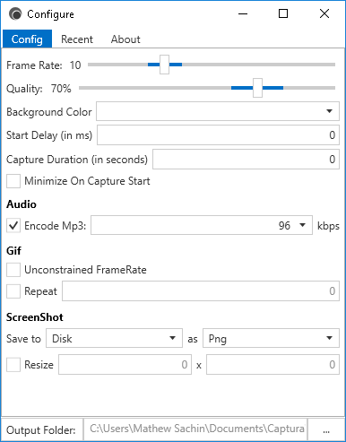

# Captura

  
&copy; [Copyright 2016](LICENSE.md) Mathew Sachin

Capture Screen, Audio, Cursor, Mouse Clicks and Keystrokes using [Screna](https://github.com/MathewSachin/Screna).

# Features
- Take ScreenShots
- Capture ScreenCasts (Avi/Gif)
- Capture with/without Mouse Cursor
- Capture Specific Regions or Windows
- Capture Mouse Clicks or Keystrokes
- Record Audio from Microphone **AND/OR** Speaker Output (Wasapi Loopback)

# ScreenShots

# Getting Started
1. [Visual Studio 2015](https://visualstudio.com) or greater is required.
2. Clone the repository: `git clone https://github.com/MathewSachin/Captura.git`.
3. Fetch Submodules: `git submodule init` and `git submodule update`.
4. Restore NuGet packages for `Screna.sln` in `Screna` folder.
5. Restore NuGet packages for `Captura.sln` in `src` folder.
6. Download [BASS Audio library](http://www.un4seen.com/download.php?bass24) (*bass.dll* - x86/x64 as required) and place in build output folder.
7. Download [BASSmix](http://www.un4seen.com/download.php?bassmix24) (*bassmix.dll* - x86/x64 as required) and place in build output folder.
8. Download [Lame Mp3 Encoding libraries](http://lame.sourceforge.net) (**Optional**) (need licensing for commercial use) (_lameenc32.dll_ and _lameenc64.dll_) and place in build output folder.

> The dependency libraries for x64 can be found in [Releases](https://github.com/MathewSachin/Captura/releases).

# Acknowledgements
- [SharpAvi](https://github.com/bassill/sharpavi) for helping improve the idea.
- [Material Design Icons](https://materialdesignicons.com) for the Icons.
- [Modern UI](https://github.com/firstfloorsoftware/mui) for the styles.